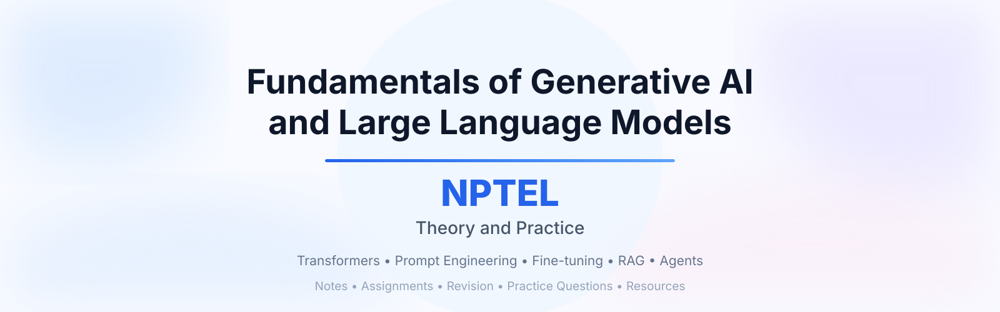

# Fundamentals of Generative AI and Large Language Models: Theory and Practice — NPTEL

Notes, slides, assignment solutions, and revision material for the NPTEL course **Fundamentals of Generative AI and Large Language Models: Theory and Practice** by Prof. Sriram Ganapathy, Prof. Ashwini Kodipalli, and Prof. Baishali Garai, Indian Institute of Science, Bangalore.

## Syllabus

| Week | Topics |
|------|--------|
| Week 1 | Fundamentals of Deep Learning for Generative AI: Generative AI overview, neural network revision, CNNs (LeNet, VGG, ResNet) |
| Week 2 | Autoencoders: encoder-decoder architecture, bottleneck representation, denoising autoencoders |
| Week 3 | Variational Autoencoders (VAEs): latent variable models, reparameterization trick, ELBO |
| Week 4 | Advanced VAEs: Conditional VAE, Beta-VAE, disentanglement, latent interpolation |
| Week 5 | Generative Adversarial Networks (GANs): generator-discriminator, minimax objective, DCGAN |
| Week 6 | Advanced GAN Variants: cGAN, CycleGAN, Pix2Pix, StyleGAN/StyleGAN2, evaluation metrics |
| Week 7 | Diffusion Models: forward diffusion process, variance schedules, noise prediction |
| Week 8 | Reverse Diffusion, UNet Architecture, and Training: DDPM pipeline, classifier guidance |
| Week 9 | Sequence Models, NLP Basics, and LSTMs: RNNs, LSTMs, motivation for Transformers |
| Week 10 | Foundations of LLMs and Prompt Engineering: Transformer architecture, self-attention, tokenization |
| Week 11 | Retrieval-Augmented Generation (RAG): retrieval and generation mechanisms, in-context learning, LoRA |
| Week 12 | LLM Capabilities, Multimodal AI, and Ethics: bias, fairness, hallucinations, safety, evaluation |

## Repository Structure

Each `Week-XX/` folder contains:
- `slides/` — lecture slides/notes
- `assignment-solutions/` — weekly assignment questions, solutions, explanations
- `revision/` — quick revision and important concepts

## Credits

- All lecture content and slides referenced/summarized in this repository belong to **NPTEL** and are based on the official course *Fundamentals of Generative AI and Large Language Models: Theory and Practice* taught by Prof. Sriram Ganapathy, Prof. Ashwini Kodipalli, and Prof. Baishali Garai, Indian Institute of Science, Bangalore. This repository is an independent, unofficial set of personal notes for learning purposes — not affiliated with or endorsed by NPTEL.
- Official platform: [NPTEL / SWAYAM](https://onlinecourses.nptel.ac.in/)

## License

See [LICENSE](./LICENSE).